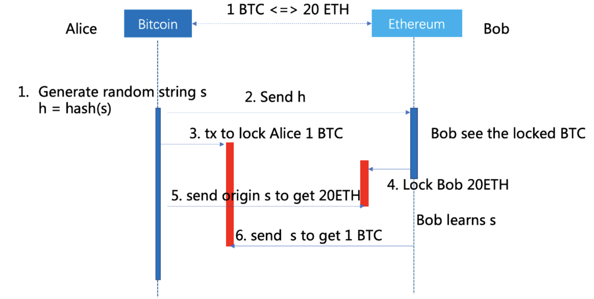

# Cosmos 跨链方案剖析

## 背景

最近一段时间，我们（Blockchain BU）正在与客户一同研讨我们为客户开发的**区块链项目的通证跨链技术解决方案**，与区块链跨链领域的初创团队一同制定具体的跨链落地方案。

在此过程中，我们对区块链的侧链/跨链以及第二层扩容这一新兴的技术领域不断有了新的发现和积累。在与更多的客户沟通中我们发现，**有越来越多的跨链项目机会正在发生**，因为侧链/跨链技术乃至整个区块链扩容技术会一直是行业热点和突破方向，我们也会持续关注这一技术。

同时**我们希望我们对技术的掌握是系统性的**，尤其是新兴的和不断变化的技术，我们计划在未来发布对完整区块链扩容技术的剖析：包括零层扩容、一层扩容（e.g. Sharding）、二层扩容（e.g. Sidechain/Crosschain/State Channel）和一些项目及案例的分析。

这篇博客是对二层扩容中跨链技术解决方案和明星项目 — Cosmos 的剖析。

## 区块链跨链技术概览

随着互联网的深度发展，区块链技术逐渐萌芽并取得迅速发展，迄今为止区块链生态中已经存在有如比特币、以太坊、EOS、Hyperledger Fabric、Corda 等多个较为成熟的区块链平台。但是各个区块链平台都是独立存在的，各个区块链平台上的资产和信息是相互隔离的，正在逐渐**形成区块链的价值孤岛**。

**但价值孤岛的形成并不利于区块链真正价值的发挥**，只有各个链上的信息实现更好的连通和整和，才能更好的拓展区块链的边界，更好的发挥出其真正的价值。且独立、自治的区块链必然要放弃与其他链上应用程序无缝通信的能力，因为它们存在于具有不同状态机的独立的区块链上。

因此，**能够打通各个区块链间的壁垒势在必行，这就是跨链的由来**。但对于跨链这一领域的探索，整个行业也处在一个初期的阶段。Cosmos 就是跨链领域的一个明星项目，它正试图通过特定方案解决这一问题。

## Cosmos 是什么？

#### Cosmos 介绍

“**一个由多条独立平行区块链组成的去中心化网络，每条平行区块链均采用 BFT 共识算法**。“

**Cosmos Network 是由许多被称之为"分区"\(Zone\) 的独立区块链组成的网络**。分区在 Tendermint BFT 的支持下运行，Tendermint BFT 是一个**拜占庭容错的安全共识引擎**，具有高性能、一致性的特性，并且在**严格的分叉追责机制**下能够制止恶意破坏者的行为。Tendermint BFT 的拜占庭容错共识算法十分适合用于扩展权益证明（PoS）机制下的公链。以及使用其他共识模型的区块链，包括类似基于权益证明（Casper CBC）的以太坊，以及 Bitcoin 也能够通过使用适配分区（Peg Zone）被 Cosmos 网络连接。

**Cosmos 的第一个分区称之为 Cosmos 枢纽（Hub）**。Cosmos 枢纽是一种多资产权益证明加密货币网络，它通过简单的治理机制（投票）能够对网络进行适配和升级。此外，Cosmos 枢纽可以通过链接其他分区来实现扩展。

Cosmos 网络的枢纽及各个分区可以通过**区块链间通信（IBC）协议**进行通信，这种协议就是针对区块链的虚拟用户数据报协议（UDP）或者传输控制协议（TCP）。**代币可以安全、快速地从一个分区转到其他分区**。相反，所有跨分区的代币转移都会通过 Cosmos 枢纽，以此来**追踪记录每个分区持有代币的总量**。这个枢纽会将每个分区与其他故障分区隔离开。因为每个人都可以将新的分区连接到 Cosmos 枢纽，所以分区将可以**向后兼容**新的区块链技术。

利用 Cosmos 可以实现**区块链间的互操作性**。这是一个**具有潜力的有价值的互联网络**，其中的资产由不同的验证人发布和控制，并可以在不依靠需要信任的第三方的情况下实现跨链资产无缝的转移和交易。

#### 解决什么问题

这一架构解决了当今区块链领域面临的许多问题，包括区块链应用的**互操作性**、**可扩展性**、以及**可无缝升级, 系统性能**的能力。比如，从 Bitcoin、Ethereum 或其他区块链系统中衍生出来的分区，都能被锚定接入 Cosmos 枢纽。这些分区允许 Cosmos 实现无限扩展，从而满足全球交易的需求。此外，分区也完全适用于分布式交易所，反之交易所也支持分区运行。

Cosmos 不仅仅是单一的分布式账本，**Cosmos 正在为分布式账本的开放网络设计一套协议**，这套协议将基于密码学、稳健经济学、共识理论、透明性及可追责制的原则，成为未来金融系统的全新基础。

#### 应用场景

* 使用 Cosmos 跨链协议和网络的**去中心化交易所** — 币安
* 以太坊的扩展 — Ethermint
* 多应用一体化 — 将不同的应用链及区块链衍生品进行融合

### Cosmos 的架构解剖

**区块链结构简介**

区块链的本质是「确定性复制状态机」。

复制状态机在概念上有3个层级：

* **应用层** 应用层负责定义状态变迁，并在事务发生后更新状态机状态。
* **共识层** 共识层由算法组成，负责确保在事务执行后每一台状态机都存储相同的状态（即，某一状态机无法伪造不存在的事务）。
* **网络层** 网络层负责将在某一个状态机上执行的事务传播到网络中其他所有状态机上。
* **抗女巫攻击层\(抽象\)** 试图在去中心化公网运行的复制状态机还需要第四层（“抗女巫攻击层”），确保任何一台状态机都不能破坏网络。

### Tendermint

**Tendermint 本质上是一个开源的完整的区块链实现，是 Cosmos 的核心技术。**

可以试着这样来解读 Tendermint，Tendermint 可以理解为一个**模块化的区块链软件框架**，支持开发者个性化定制自己的区块链，而又不需要考虑共识以及网络传输的实现。

#### **Tendermint 原理**

Tendermint 官方解读

> Tendermint is software for securely and consistently replicating an application on many machines. By securely, we mean that Tendermint works even if up to 1/3 of machines fail in arbitrary ways. By consistently, we mean that every non-faulty machine sees the same transaction log and computes the same state. Secure and consistent replication is a fundamental problem in distributed systems; it plays a critical role in the fault tolerance of a broad range of applications, from currencies, to elections, to infrastructure orchestration, and beyond. Tendermint consists of two chief technical components: a blockchain consensus engine and a generic application interface. The consensus engine, called Tendermint Core, ensures that the same transactions are recorded on every machine in the same order. The application interface, called the Application BlockChain Interface \(ABCI\), enables the transactions to be processed in any programming language. Unlike other blockchain and consensus solutions, which come pre-packaged with built in state machines \(like a fancy key-value store, or a quirky scripting language\), developers can use Tendermint for BFT state machine replication of applications written in whatever programming language and development environment is right for them.

官方给出的 Tendermint 定义总结如下：

* Tendermint 是一个能够在不同机器上，**安全一致复制应用**的软件。
* Tendermint 具备拜占庭容错能力，具备**拜占庭容错共识算法**。
* Tendermint 主要有两部分组成：

  * **Tendermint Core**：**区块链共识引擎**，负责节点之间数据传输以及拜占庭共识。
  * **ABCI**：**区块链应用程序接口**，也是一个协议，支持任何语言的交易处理实现。

  其架构如下图所示：

### **共识层**

Tendermint 的共识机制基于**拜占庭容错算法**，通过 **PoS 协议**来抵抗女巫攻击。

按照规则，**验证者要按轮次（round）对每一个区块达成共识**。每一轮都包含三个基本步骤：**提议阶段（Propose）**、**预投票阶段（Prevote）**、**预提交阶段（Precommit）**，以及两个后续步骤：**提交阶段（Commit）**、**新高度阶段（NewHeight）**。

![!\[https://s3-us-west-2.amazonaws.com/secure.notion-static.com/e95d770b-439c-4a3d-8e29-62d71cbf3664/Untitled.png\]\(https://s3-us-west-2.amazonaws.com/secure.notion-static.com/e95d770b-439c-4a3d-8e29-62d71cbf3664/Untitled.png\)  &#x56FE;&#x7247;&#x6765;&#x6E90;&#xFF1A;\[https://tendermint.com/docs/introduction/what-is-tendermint.html\#consensus-overview\]\(https://tendermint.com/docs/introduction/what-is-tendermint.html\#consensus-overview\)](.gitbook/assets/image%20%288%29.png)

1. 首先是**提议**阶段，由指定的验证者提出一个区块——每一轮中的提议者都是从有序的列表中按照投票**权重（Stake based）**的比例，确定性地选择出来的。

   整个过程中的投票比例是基于 Stake 比例来进行计算的，根据每一位验证人节点抵押的代币数量每一位验证人节点拥有不同的投票权重。

2. 接着进入**预投票**阶段——每一位验证者广播他们各自的预投票。（使用 gossip 协议来进行广播）
3. 当该轮次中某一区块收到超过 **2/3** 的预投票，我们就称其为 “polka”。一旦出现 “polka”，就进入下一个阶段。
4. 进入**预提交**阶段，由每一个验证者广播他们的预提交的投票。

   * 如果某一特定区块收到超过 **2/3** 的预投票，就进入**提交**阶段，这个阶段会将区块加入区块链，并**增加区块高度**。每当有新的区块加入区块链，所在区块链的区块高度就 +1。
   * 如果失败，则要么返回**预投票**阶段，要么回到**预提交**阶段。

   在任何高度上，都有可能需要**一轮及以上的投票**才能提交一个区块。因为可能出现以下情况：

5. 被指定的“提议者”在应该提出区块时掉线
6. 提议者所提出的区块违反一些预先定义的规则
7. Tendermint 依靠超时机制确保区块链出块不会遇到延宕。如果在超时前，提议区块没有收到超过 2/3 的预投票，则由新的提议者再次进行提出区块流程。

### **网络层**

**网络层负责交易和数据传输和同步。**

**btcd P2P Address Book** Tendermint 的 P2P 网络协议借鉴了比特币的**对等发现协议**，更准确地说，Tendermint 是采用了 **btcd 的 P2P 地址簿（Address Book）机制**。当连接建立后，新节点将自身的Address 信息（包含IP、Port、ID等）发送给相邻节点，相邻节点接收到信息后加入到自己的地址薄，再将此条Address信息，转播给它的相邻节点。

**Station-to-Station** 为了保证节点之间**数据传输的安全性**，Tendermint 采用了基于 Station-to-Station 协议的认证加密方案，此协议是一种密钥协商方案，基于经典的 **DH 算法**，并提供相互密钥和实体认证。

S2S 的大致流程如下 

1. 每一个节点都必须生成一对ED25519密钥对作为自己的ID。 
2. 当两个节点建立起TCP连接时，两者都会生成一个临时的ED25519密钥对，并把临时公钥发给对方。
3. 两个节点分别将自己的私钥和对方的临时公钥相乘，得到共享密钥。这个共享密钥对称加密密钥。 
4. 将两个临时公钥以一定规则进行排序，并将两个临时公钥拼接起来后使用Ripemd160进行哈希处理，后面填充4个0，这样可以得到一个24字节的随机数。 
5. 得到的随机数作为加密种子，但为了保证相同的随机数不会被相同的私钥使用两次，我们将随机数最后一个bit置为1，这样就得到了两个随机数，同时约定排序更高的公钥使用反转过的随机数来加密自己的消息，而另外一个用于解密对方节点的消息。 
6. 使用排序的临时公钥拼接起来，并进行SHA256哈希，得到一个挑战码。 
7. 每个节点都使用自己的私钥对挑战码进行签名，并将自己的公钥和签名发给其它节点校验。 
8. 校验通过之后，双方的认证就验证成功了。后续的通信就使用共享密钥和随机数进行加密，保护数据的安全。

[https://en.wikipedia.org/wiki/Station-to-Station\_protocol](https://en.wikipedia.org/wiki/Station-to-Station_protocol)  
[https://zh.wikipedia.org/wiki/迪菲-赫爾曼密鑰交換](https://zh.wikipedia.org/wiki/%E8%BF%AA%E8%8F%B2-%E8%B5%AB%E7%88%BE%E6%9B%BC%E5%AF%86%E9%91%B0%E4%BA%A4%E6%8F%9B)\*\*\*\*

### **应用层**

* 应用层可以使用**任何语言**来构建。
* 应用层应实现该链上完整的**业务逻辑**。
* 应用层需要实现 Tendermint **ABCI** 所约定的**特定接口**， 例如 checkTx, deliverTx 等。

  总的来说，应用层负责：

* 定义和提交需要被记录进区块链的交易
* 在交易通过共识层提交后，持续更新区块链状态

  应用层通过 ABCI 接口与 Tendermint Core 进行连接，抽象来讲，应用层的接入如下图所示：

## **验证人**

* **验证人限制** 在创世日, 验证人的最大数量将设置为 **100**, 这个数字将以 **13%** 的速度增长 **10 年**, 最终达到 **300** 位。
* **验证人更替 任何 Atom 持有者在任何时候可以通过签署和提交 BondTx 交易成为验证人**，其持有 Atom 的数量必须大于现有验证人中最少持有有效 Atom 的数量。替换现有的验证人时, 现有的验证人将离线，其所有的 Atom 进入解绑状态。
* **后置惩罚** 由于 **PoS 的先天局限性**，对于恶意验证人的惩罚显然是后置性的。 当验证人作恶时，拥有某些特定的证据可**立即可被受理**, 比如在同样高度区块和回合的双重签名。其抵押的 **Atom** 和在储备金中的**权益**会受到大幅削减。 当验证人因为网络中断、电源故障等原因不可用时，若验证人**缺席一定次数的投票时**，该验证人将离线，并减少其**权益**。 **恶意行为被举报**且存在多数协商一致，验证人会被**强制超时**，削减抵**押金**和**权益**。 有意思的是，当 Cosmos Hub **超过 1/3 的投票权离线或进入审查时**，此时**网络中断**。这时候 Hub 就必须借助**硬分叉重组协议**来进行恢复。

#### **Tendermint 的其他特性：**

**Finality** / 最终确定性  
对比 Bitcoin 共识机制—最长的链才是合法的。由于存在不同的矿工同时挖出下一个区块的可能性，比特币可能出现短暂的分叉，任何被提交到链上的交易不能百分百被确认因为有可能在分叉的链上，往往需要经过几个区块时间交易才能被确认，概率学上来将这也就是我们常说的 [6个确认时间](https://en.bitcoin.it/wiki/Confirmation)。

而 Tendermint 共识机制则不同，当 Validator 提交该区块后，则该区块立即被确认了。

**可变验证人及验证人限制**

**Tendermint 链会随着验证人的增加而变慢**，是由于通信的复杂性增加导致的。与 Bitcoin 的矿工不同，**Tendermint 链有验证人上限**。 以 Cosmos Hub 为例，在创世日, 验证人的最大数量将设置为 100, 这个数字将以 13% 的速度增长 10 年, 最终达到 300 位。任何 Atom 持有者在任何时候可以通过签署和提交 BondTx 交易成为验证人，除非当前验证人组的数量超过了最大值。当验证人发生替换时，替换条件为：新验证人持有的 Atom 比现有的持有最少有效的 Atom 的验证人的 Atom 多。 简单讲就是谁有钱谁上。

**明确的超时机制**

与 Bitcoin 和 ETH 的共识机制不同，**Tendermint 有明确的超时机制**，保证投票和出块过程不会宕延，如果**预投票不通过或者超时**则由新的 Proposer 发起下一轮打包和投票。

**责任制**

Tendermint 使用 PoS 作为抗女巫攻击机制。由于 PoS 先天性的 Nothing At Stake 特性，Tendermint 制定了相关的责任机制来应对这一问题。

* 分区的安全性与责任制

  Cosmos Hub 不会验证或执行提交到其他分区的交易，因此将代币发送到可靠的分区间就是用户的责任了。

  验证者节点以及对应的委托人节点对结果负责，若验证者节点对伪造的交易或分叉上多处签名，则该次不忠诚的行为将对验证者节点进行惩罚。

* 网络分叉的责任制

  当网络中超过1/3的节点集合作恶或进入审查状态离线时，Cosmos 网络将会中断，其他非作恶节点会根据硬分叉协定投票进入分叉流程，作恶验证者节点所抵押的保证金及权益将被罚没。

**兼容性**

Tendermint 的兼容性体现在其理论上**可以支持开发使用任何语言**来开发其应用层和链上逻辑，而无需关心网路层和共识层。

从更高的层面上来将， Cosmos 的兼容性体现在其对确定链（具备出块确定性的链）和概率链的兼容，通过 **Peg Zone 将 Hub 与概率链进行桥接**。这一点会在后续章节展开介绍。

**轻量性**

轻量性体现在除了负责验证和出块的节点外，**其余节点不需要下载和存储区块的完整状态**，只需要存储对应链的区块头，通过 Merkle Proof 来对其他链上的特定交易进行查询和验证。

## IBC

**IBC\(Inter Blockchain Communication\) 是一种协议，用于枢纽与分区之间的通信。**

假如现在有三个区块链，分别是"分区 1"、“分区 2"以及"枢纽”，我们想要"分区 1"生成一个数据包，通过"枢纽"发送给"分区 2"。为了让数据包从一个区块链转移到另一个区块链，需要在接收方区块链上发布一个证明，来明确发送方已经发起了一个数据包到指定目的地。接收方要验证的这个证明，必须和发送方区块头保持一致。这种机制就类似与侧链采用的机制，它需要两个相互作用的链，通过**双向传送存在证明数据元**（交易），来"知晓"另一方的情况。

IBC 协议可以自然定义为两种交易的使用：

* **IBCBlockCommitTx**，这种交易可以让区块链向任何观察员证明其最新区块哈希值；
* **IBCPacketTx**，这种交易则可以证明某个数据包确实由发送者的应用程序，通过默克尔证明机制（Merkle-proof）传送到了最新区块的哈希值上。

通过将 IBC 机制分离成两个单独的交易，即 IBCBlockCommitTx 交易与 IBCPacketTx 交易，我们可以让接收方链的本地费用市场机制，来决定承认哪个数据包，与此同时还能确保发送方的完全自由，让其自行决定能够传出的数据包数量。

在上述案例中，为了更新"枢纽"上"分区 1"的区块哈希（或者说"分区 2"上"枢纽"的区块哈希），必须将 IBCBlockCommitTx 交易的"分区 1"区块哈希值发布到"枢纽"上（或者将该交易的"枢纽"区块哈希值发布到"分区 2"中）。

IBC 协议目前证在开发中，对开发者而言还不稳定，更多关于 IBC 的内容我们会放到 [Cosmos SDK 快速建链](https://www.notion.so/Cosmos-SDK-44aa4fdcfd0d4b8fbbcf3036be7b441d) 进行介绍。在该篇文章中，问具体的剖析 Cosmos SDK 的不同模块以及 IBC、ABCI 等协议的具体内容及使用流程。此外，在该节中还计划对 Cosmos Network 的部署拓扑进行分析。

## 发行与激励

**ATOM 代币**

Cosmos Hub 是多资产分布式账本，它有自己的代币 **Atom** 。**Atom 是持有人投票、验证或委托给其他验证人的许可证明**，Atom 也可以用来支付交易费。从创世块开始，Atom 总量的 1/3 将作为奖励发放给每年担保持有的验证人以及委托人。

**验证人激励**

验证人需要锁定其持有的 Atom 来竞选验证人。在未来验证人可以接受任何种类的代币或组合作为处理交易的费用。

**黑客激励**

为了鼓励发现和早期报告发现的漏洞, **Cosmos Hub 鼓励黑客通过 ReportHackTx 交易发布成功的漏洞**。这种情况下, 验证人和委托人将挂起闲置, HackPunishmentRatio \(默认 5%\) 的 Atom 将被削减, 发送到黑客的赏金地址作为奖励。验证人必须使用其备份密钥来恢复剩余的 atom。

## Cosmos 的优势

* Cosmos 聚焦于跨链资产转移，且设计的跨链方案相对简单，这个简单并不是贬义，在实现跨链需求（目前是资产转移）的前提下，协议和架构尽可能的简单是一件好事。
* Cosmos 所使用的 BPoS （based on BFT 的 PoS）是目前成熟度相对较高的共识机制。
* Cosmos SDK 提供较好的开发支持。开发者可以在其工具和生态的支持下快速“造链"和快速接入。
* 开发者可以使用任何编程语言和框架开发 Tendermint 特定应用链。
* 在 Cosmos Network 中，每条链都是独立运行的，并且设有自己的验证人和独立的共识机制，拥有独立的安全机制。且若在 Cosmos 中存在作恶事件的时候，只会影响到某一个应用链，而不会影响到整个 Cosmos 网络。
* 在治理规则上，Cosmos Network 中任何节点只要满足特定条件都可以申请成为验证人参与Cosmos 网络治理。
* 在 Cosmos 网络中，对于每一个 Zone 来说，它们可以保留其原有的共识算法，只要该共识算法满足 ABCI 接口即可。
* Cosmos 主网已经上线，这让 Cosmos 在经验上的领先超过至少一年。
* Cosmos 的生态和多方优质项目的支持。例如：Binance Chain、IRISnet、Loom、Terra 等。
* Cosmos 的 TPS 可以达到 10K 的量级。

## Cosmos 的缺点

* Cosmos 没有解决分区安全性的问题，或者说 Cosmos 避开了 Cosmos 安全性的问题，一旦某个分区被恶意节点攻陷，该分区可以任意向 Hub 提交伪造的交易，而 Cosmos Hub 不会去验证交易本身的合法性，是否信任该分区则完全是其他分区或者用户的。
* 由于在 Cosmos 网络中，每个 Zone 都有自己的验证人，各个应用链存在独立的安全性，因此就会存在多条应用链的验证人节点串谋作恶的情况。
* 在 Cosmos 某个分区作恶的成本较低。Cosmos 由于采用分区，并且最终的安全性仅由该分区的验证者节点负责，考虑到 BPoS 本身的 N@S 特性，因此在 Cosmos 某个分区作恶的成本是比较低的，但是并不会影响到其他分区。
* Cosmos 对验证人节数量的限制，虽有助于提升网络性能，但使得作恶成本降低。
* IBC 协议还不成熟，对于开发者来讲还不稳定。
* 由于在 Cosmos Network 中，各个 Zone 都依赖于同一个 Hub，所谓的跨链交互些许会有中心化的质疑。
* Cosmos 目前只支持资产转移，并不支持跨链通信。（在未来的线路图里）

## Cosmos 的一些指标

**Tendermint 具备杰出的性能。**

以商用型云平台为例，Tendermint 共识以分布在五大洲七个数据中心的 64 位节点为基准，**TPS** 可以达到 **10k** 量级，订单提交**延迟时间为 1-2 秒**。而值得关注的是，即使是在极其恶劣的敌对环境中，比如验证人崩溃了或者是广播恶意破坏的投票，也能维持这种每秒超过千笔交易的较高性能。详见下图。

图片来源： [https://cosmos.network/resources/whitepaper](https://cosmos.network/resources/whitepaper/zh-CN)

## Cosmos 的生态

Cosmos 主网一经发布，其代币 Atom 的价格便较众筹时涨了超过40倍，目前，参与 Cosmos 生态的优质项目越来越多，如下所示。

其中包括顶部去中心化交易所币安链、作为另一个枢纽的 IRISnet Hub 、允许开发者用 Rust 语言在 Cosmos 网络中开发智能合约 CosmWasm 项目等。

## Concepts

**枢纽**：指 Cosmos 网络中第一个分区，其他分区将与该枢纽建立连接。  
**分区**：指一条独立的链，该链通过 IBC 协议接入 Cosmos Hub 继而接入 Cosmos 网络。  
**Merkle-proof \(默克尔证明\)**：默克尔证明指的是在默克尔树中不需要知道一个数据集合中的其他值就能证明某个值属于这个集合。  
**Coin Packet**: IBC 协议中将交易记录打包的数据包。  
**BFT**：Byzantine Fault Tolerance, 拜占庭容错，解决拜占庭将军问题的共识机制。  
**BitShares**：比特股是一个全球去中心化虚拟货币交易所，其代币是 BTS  
**Stellar**：是Jed（电驴创始人、Ripple技术创始人）创建，是一个通用的金融平台，允许任何人方便的收付款。  
**BitcoinNG**：Bitcoin-NG是一种区块链协议，可以像比特币一样对交易进行序列化，但是可以在不牺牲其他属性的情况下提供更好的延迟和带宽。  
**Casper**：Casper 是 ETH 2.0 所采用的 PoS 协议，目前为止，在以太坊生态系统中已经有两个共同开发的 Casper 版本：Casper CBC 和Casper FFG。  
**HD 算法**：它可以让双方在完全没有对方任何预先信息的条件下通过不安全信道创建起一个密钥。这个密钥可以在后续的通讯中作为对称密钥来加密通讯内容。[https://zh.wikipedia.org/wiki/迪菲-赫爾曼密鑰交換](https://zh.wikipedia.org/wiki/%E8%BF%AA%E8%8F%B2-%E8%B5%AB%E7%88%BE%E6%9B%BC%E5%AF%86%E9%91%B0%E4%BA%A4%E6%8F%9B)  
**Station-to-Station protocol**：在公钥密码学中，STS 协议是一种密钥协议方案。该协议基于经典的 Diffie Hellman 协议，提供了相互密钥和实体身份认证（mutual key and entity authentication）。与经典的 Diffie Hellman 不同，它不能防止中间人攻击，该协议假设各方都有签名密钥，用于对消息进行签名，从而提供了防止中间人攻击的安全性。[https://en.wikipedia.org/wiki/Station-to-Station\_protocol](https://en.wikipedia.org/wiki/Station-to-Station_protocol)  
**Veyager Node**: 委托人节点  
**Lite Node**： 轻量级客户端节点  
**Full Node**：全节点  
**同构跨链**：指进行跨链的链之间安全机制、公式算法、网络拓扑、区块生成验证逻辑一致。  
**异构跨链**：与同构跨链所面临的情况相反  
**Interledger**：The interledger protocol\(ILP\) 通过一个松散耦合的双边关系网络，提供一种指定的跨不同账本系统交互操作。  
**SPV**：Simple Payment Verification，是一个简单的支付确认方式，可以在不运行完整网络节点的前提下对支付结果进行验证。  
**Ethereum 2.0 Mauve**：Mauve 是以太坊 2.0 的新版本，主要为了解决其共识问题和扩容问题。其中发布 Mauve Paper 被称为紫皮书。直指以太坊存在的两大问题：以工作量证明（proof-of-work）为基础的共识机制低效、耗能、不绿色环保，以及以太坊公链系统吞吐量（throughput）和容量均不足以支撑全球大范围高频次使用。  
**分叉问责制**：一个共识协议应该能够在超出容错能力或者共识出错的情况下为系统提供一定的保障的机制。分叉问责制就是拥有这种用途，它可以使一个导致共识出错的进程（例如使协议客户端开始接受不同值—即分叉）被识别出来，并且根据协议规则对其进行惩罚，甚至将其移送至司法系统处置。  
**LRA \(远程攻击\)**：由于在 Cosmos 网络中，验证人是能够变化的，那么在较长的时间段内最初的一些验证人会被解除押金的绑定，就会导致他们可以自由地从创世区块中创建新链，并且他们不再有被锁定的保证金，他们就不需要对这个行为支付任何费用，这种攻击就被成为远程攻击。  
**简单默克尔树**：默克尔树是一种哈希二叉树，而简单默克尔树只针对基础的静态列表。如果默克尔树的项数不是 2 的 n 次方个，就会导致有些叶子节点在树的不同层上。简易默克尔树试图让树的两侧都在同一高度，可能左侧会稍微大点。这种默克尔树被称为简易默克尔树，用于一个区块交易的默克尔化，其中顶层元素就是应用状态的根。  
**IAVL+树**：IAVL+ 树是为了永久存储应用状态中的秘钥对，通过该树可以确定对默克尔根哈希进行高效的运算。这个树的平衡通过 AVL 算法的变体来实现，所有运行都是O\(log\(n\)\)的。  
**后置惩罚**：由于 POS 共识的特点，对于恶意验证人的惩罚都是后置的。也即如果判断某次出块为恶意出块行为，就会将质押的一部分代币或保证金作为罚金。但这些所有的惩罚和监管措施都只在事后发生，而不像 PoW 共识需算力出块的隐形约束直接。

### References

[Cosmos Network - Internet of Blockchains](https://cosmos.network/resources/whitepaper)  
[cosmos/ics](https://github.com/cosmos/ics/tree/master/ibc)  
[cosmos/cosmos-sdk](https://github.com/cosmos/cosmos-sdk)  
[How does Cosmos work? How does it compare to Bitcoin and Ethereum? \(Pt. 1\) - Blog by Preethi Kasireddy](https://www.preethikasireddy.com/posts/how-does-cosmos-work-part1)  
[How does Cosmos work? How does it compare to Bitcoin and Ethereum? \(Pt. 2\) - Blog by Preethi Kasireddy](https://www.preethikasireddy.com/posts/how-does-cosmos-work-part2)  
[深度解析Tendermint，快速融入Cosmos生态](https://zhuanlan.zhihu.com/p/38252058)  
[Cosmos 区块链的工作原理，Part-1：比较 Cosmos 与比特币、以太坊](https://ethfans.org/posts/how-does-cosmos-work-part1)

